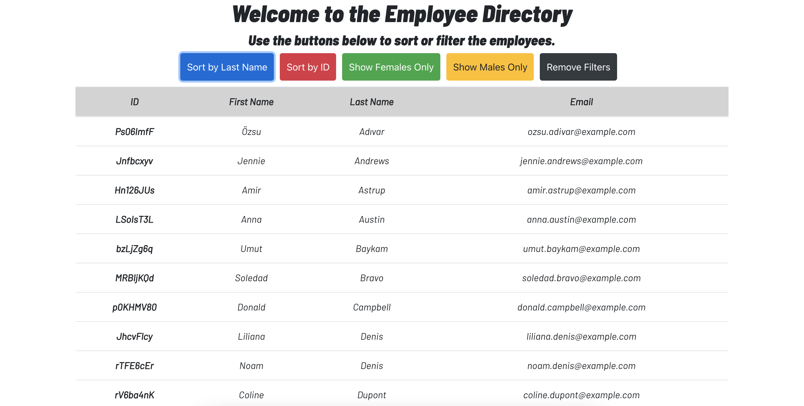
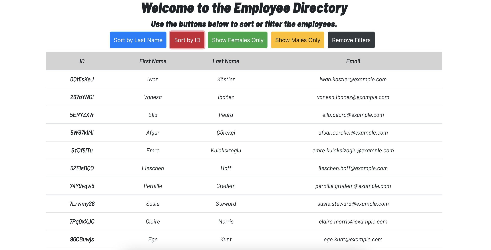
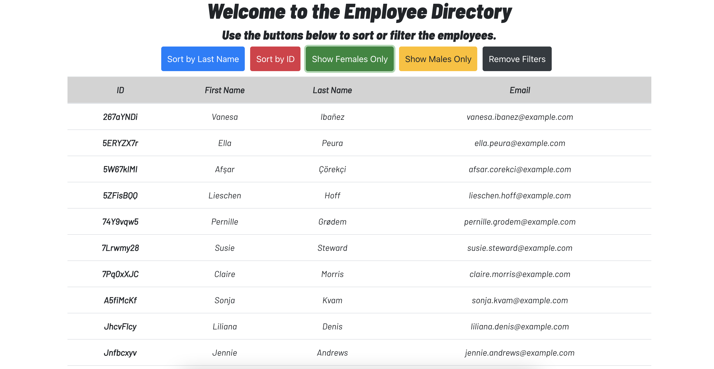
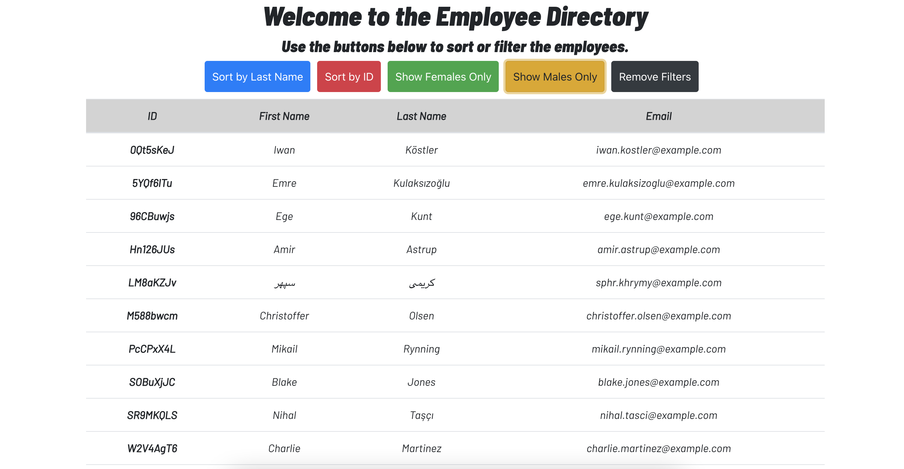

# React Employee Directory
  ## Table of Contents
  - [Description](#description)
  - [Installation](#installation)
  - [Screenshots](#contributors)
  - [Contact Me](#contact-me)

  ## Description
  This project uses React and the Random User API to display the use of React in updating UI components. Upon page load, the user is shown 50 employees. The user can sort the employees by last name, or by ID. The user can filter their employees by gender. If the user has filtered employees out, they can always revert back to the entire list by clicking the Clear Filters button.    
  

  ## Installation
  A user can install this package using the following command:
  ```
  npm install
  ```
  

  ## Screenshots
  What the users sees when the page loads:
    
  Sort employees on last names:
    
  Sort employees on id number: 
    
  Filter to female employees only: 
    
  Filter to male employees only:
  

  
  ## Contact Me
  You can check out my GitHub profile at https://www.github.com/shannonquinn91 or email me at shannon.quinn91@gmail.com.
  